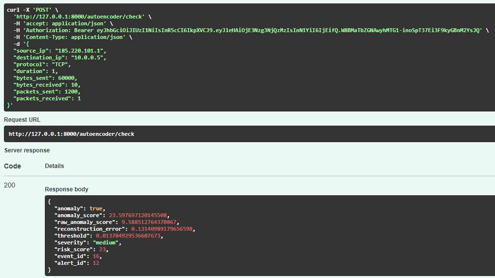

# API Examples

This document presents example API requests and responses for the main ThreatLens AI endpoints.

The screenshots below demonstrate:

- Intrusion detection
- Deep learning anomaly detection
- Hybrid AI + rule-based detection
- Security event and alert generation
- Alert management

---

# Intrusion Detection

## Endpoint

```http
POST /intrusion/check
```

## Description

The intrusion detection endpoint analyzes network traffic using:

- Feature engineering
- RandomForest machine learning model
- Rule-based cybersecurity detection

The system returns:

- Intrusion status
- Attack probability
- Detection source
- Detection reason
- Generated security event and alert IDs

---

# Example 1 — Normal Network Traffic

## Example Request

```json
{
  "source_ip": "185.220.101.1",
  "destination_ip": "10.0.0.5",
  "protocol": "TCP",
  "duration": 1,
  "bytes_sent": 60000,
  "bytes_received": 10,
  "packets_sent": 1200,
  "packets_received": 1
}
```

## Example Response

```json
{
  "intrusion": false,
  "attack_probability": 0.18059092520791975,
  "detection_source": null,
  "detection_reason": null,
  "event_id": null,
  "alert_id": null
}
```

## Swagger Screenshot


---

# Example 2 — Intrusion Detected

## Example Request

```json
{
  "source_ip": "185.220.101.1",
  "destination_ip": "10.0.0.5",
  "protocol": "TCP",
  "duration": 1,
  "bytes_sent": 6000000,
  "bytes_received": 10,
  "packets_sent": 120000,
  "packets_received": 1
}
```

## Example Response

```json
{
  "intrusion": true,
  "attack_probability": 0.20987748793453492,
  "detection_source": "rule_engine",
  "detection_reason": "Possible packet flood attack",
  "event_id": 12,
  "alert_id": 8
}
```

## Swagger Screenshot


---

# Autoencoder Anomaly Detection

## Endpoint

```http
POST /autoencoder/check
```

## Description

The Autoencoder endpoint performs deep learning-based anomaly detection for network traffic.

It uses:

- Feature engineering
- Autoencoder reconstruction error
- Threshold-based anomaly classification
- Normalized anomaly scoring
- Raw anomaly score for ML/debugging
- Severity mapping
- Risk score generation
- Automatic `SecurityEvent` creation
- Automatic `Alert` generation

This endpoint is designed to support future dashboard views, LLM-based alert explanations, and AI security assistant workflows.

---

## Example Request — Anomalous Traffic

```json
{
  "source_ip": "185.220.101.1",
  "destination_ip": "10.0.0.5",
  "protocol": "TCP",
  "duration": 1,
  "bytes_sent": 60000,
  "bytes_received": 10,
  "packets_sent": 1200,
  "packets_received": 1
}
```

## Example Response — Anomaly Detected

```json
{
  "anomaly": true,
  "anomaly_score": 23.59,
  "raw_anomaly_score": 9.58,
  "reconstruction_error": 0.131,
  "threshold": 0.013,
  "severity": "medium",
  "risk_score": 23,
  "event_id": 15,
  "alert_id": 11
}
```

## Response Fields

| Field | Description |
|---|---|
| `anomaly` | Indicates whether the Autoencoder detected anomalous behavior |
| `anomaly_score` | Normalized anomaly score designed for API/UI usage |
| `raw_anomaly_score` | Raw technical score used for ML debugging and analysis |
| `reconstruction_error` | Difference between original and reconstructed network features |
| `threshold` | Decision threshold used to classify anomaly |
| `severity` | Mapped severity level based on anomaly score |
| `risk_score` | Numeric risk score used by alerting system |
| `event_id` | ID of generated SecurityEvent |
| `alert_id` | ID of generated Alert |

## Swagger Screenshot



---

## Additional Autoencoder Examples

### Normal Traffic

This example shows network traffic that was classified as normal by the Autoencoder.


---

### Anomalous Traffic

This example shows anomalous network traffic detected by the Autoencoder.


---

# Alerts Endpoint

## Endpoint

```http
GET /alerts
```

## Description

The alerts endpoint returns generated security alerts created by:

- Intrusion detection
- Rule-based detection
- AI anomaly detection
- Autoencoder anomaly detection

Each alert contains:

- Severity level
- Risk score
- Alert status
- Event association
- Detection details

---

# Example Response

```json
[
  {
    "id": 8,
    "event_id": 12,
    "title": "Network intrusion detected",
    "severity": "critical",
    "status": "open",
    "risk_score": 95
  }
]
```

## Swagger Screenshot


---

# Summary

ThreatLens AI currently provides:

- Machine learning intrusion detection
- Deep learning anomaly detection
- Hybrid AI + rule-based cybersecurity analysis
- Security event management
- Alert generation and tracking
- JWT authentication and RBAC authorization

The system is designed to evolve into a production-ready AI-powered cybersecurity platform.