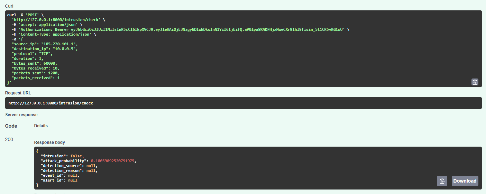
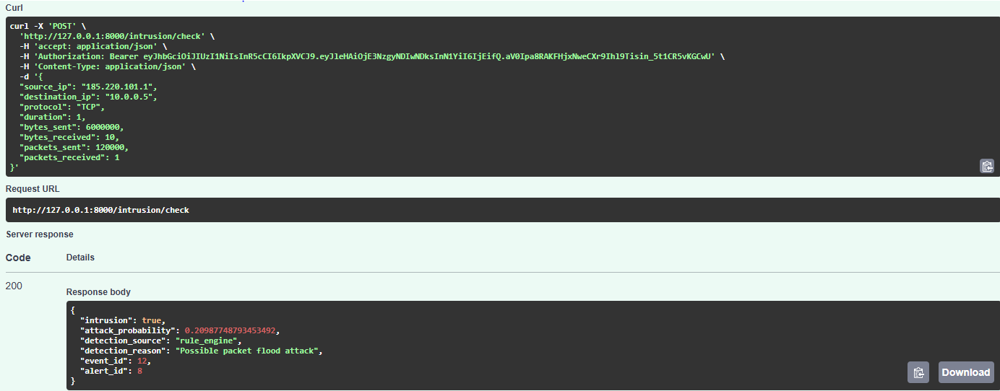
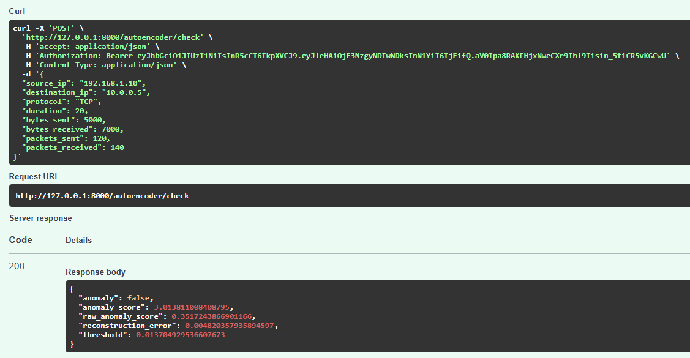
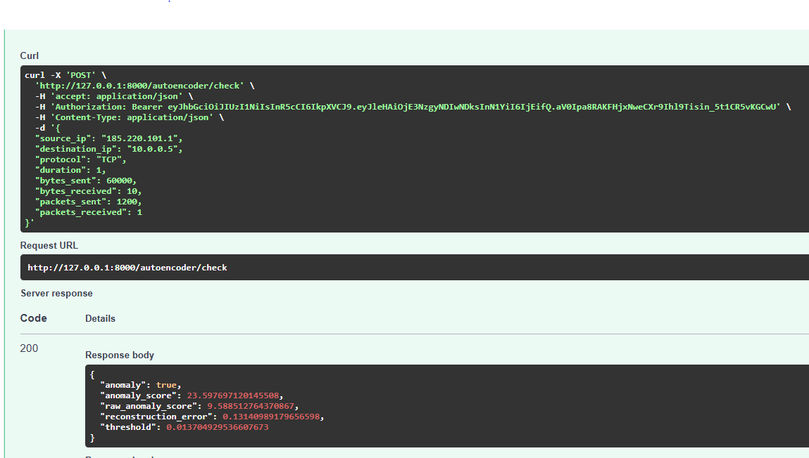
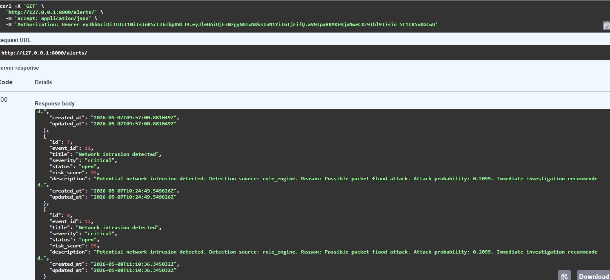

# API Examples

This document presents example API requests and responses for the main ThreatLens AI endpoints.

The screenshots below demonstrate:

- Intrusion detection
- Deep learning anomaly detection
- Hybrid AI + rule-based detection
- Alert management

---

# Intrusion Detection

## Endpoint

```http
POST /intrusion/check
```

## Description

The intrusion detection endpoint analyzes network traffic using:

- Feature engineering
- RandomForest machine learning model
- Rule-based cybersecurity detection

The system returns:

- Intrusion status
- Attack probability
- Detection source
- Detection reason
- Generated security event and alert IDs

---

# Example 1 — Normal Network Traffic

## Example Request

```json
{
  "source_ip": "185.220.101.1",
  "destination_ip": "10.0.0.5",
  "protocol": "TCP",
  "duration": 1,
  "bytes_sent": 60000,
  "bytes_received": 10,
  "packets_sent": 1200,
  "packets_received": 1
}
```

## Example Response

```json
{
  "intrusion": false,
  "attack_probability": 0.18059092520791975,
  "detection_source": null,
  "detection_reason": null,
  "event_id": null,
  "alert_id": null
}
```

## Swagger Screenshot



---

# Example 2 — Intrusion Detected

## Example Request

```json
{
  "source_ip": "185.220.101.1",
  "destination_ip": "10.0.0.5",
  "protocol": "TCP",
  "duration": 1,
  "bytes_sent": 6000000,
  "bytes_received": 10,
  "packets_sent": 120000,
  "packets_received": 1
}
```

## Example Response

```json
{
  "intrusion": true,
  "attack_probability": 0.20987748793453492,
  "detection_source": "rule_engine",
  "detection_reason": "Possible packet flood attack",
  "event_id": 12,
  "alert_id": 8
}
```

## Swagger Screenshot



---

# Autoencoder Anomaly Detection

## Endpoint

```http
POST /autoencoder/check
```

## Description

The autoencoder endpoint performs deep learning-based anomaly detection using:

- TensorFlow / Keras Autoencoder
- Reconstruction error analysis
- Threshold-based anomaly classification

The endpoint returns:

- Anomaly status
- Normalized anomaly score
- Raw anomaly score
- Reconstruction error
- Detection threshold

---

# Example 1 — Normal Traffic

## Example Request

```json
{
  "source_ip": "192.168.1.10",
  "destination_ip": "10.0.0.5",
  "protocol": "TCP",
  "duration": 20,
  "bytes_sent": 5000,
  "bytes_received": 7000,
  "packets_sent": 120,
  "packets_received": 140
}
```

## Example Response

```json
{
  "anomaly": false,
  "anomaly_score": 3.013811008408795,
  "raw_anomaly_score": 0.3517243866901166,
  "reconstruction_error": 0.004820357935894597,
  "threshold": 0.013704929536607673
}
```

## Swagger Screenshot



---

# Example 2 — Anomalous Traffic

## Example Request

```json
{
  "source_ip": "185.220.101.1",
  "destination_ip": "10.0.0.5",
  "protocol": "TCP",
  "duration": 1,
  "bytes_sent": 60000,
  "bytes_received": 10,
  "packets_sent": 1200,
  "packets_received": 1
}
```

## Example Response

```json
{
  "anomaly": true,
  "anomaly_score": 23.597697120145508,
  "raw_anomaly_score": 9.588512764370867,
  "reconstruction_error": 0.13140989179656598,
  "threshold": 0.013704929536607673
}
```

## Swagger Screenshot



---

# Alerts Endpoint

## Endpoint

```http
GET /alerts
```

## Description

The alerts endpoint returns generated security alerts created by:

- Intrusion detection
- Rule-based detection
- AI anomaly detection

Each alert contains:

- Severity level
- Risk score
- Alert status
- Event association
- Detection details

---

# Example Response

```json
[
  {
    "id": 8,
    "event_id": 12,
    "title": "Network intrusion detected",
    "severity": "critical",
    "status": "open",
    "risk_score": 95
  }
]
```

## Swagger Screenshot



---

# Summary

ThreatLens AI currently provides:

- Machine learning intrusion detection
- Deep learning anomaly detection
- Hybrid AI + rule-based cybersecurity analysis
- Security event management
- Alert generation and tracking
- JWT authentication and RBAC authorization

The system is designed to evolve into a production-ready AI-powered cybersecurity platform.