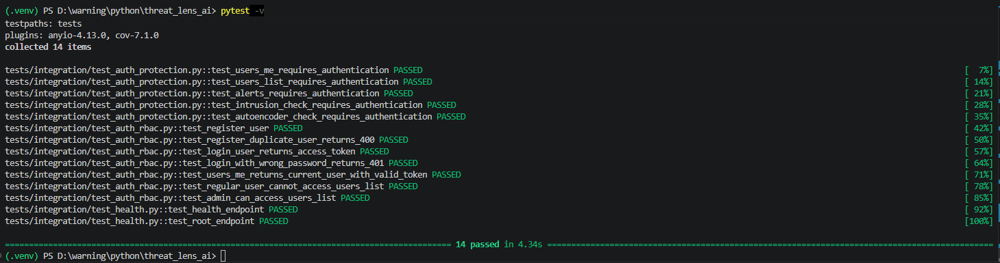
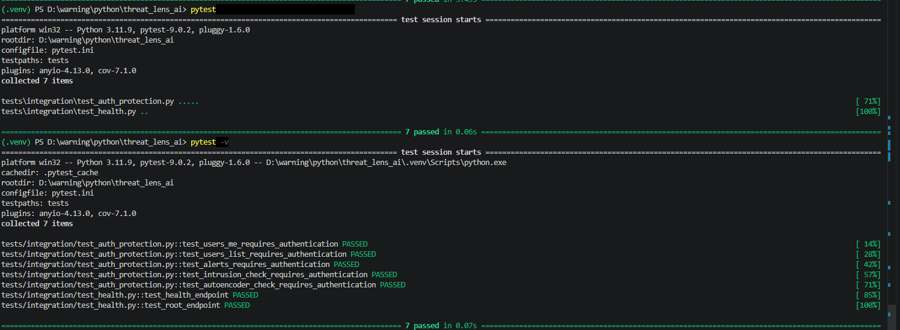

# Testing

This document describes the current testing strategy used in **ThreatLens AI**.

The project uses **pytest** together with FastAPI **TestClient** to verify API availability, authentication protection, RBAC behavior, and basic security behavior of core endpoints.

---

## Test Stack

The current test setup uses:

- `pytest` — Python testing framework
- `FastAPI TestClient` — testing FastAPI endpoints without running Uvicorn manually
- `httpx` — HTTP client used internally by TestClient
- `PostgreSQL test database` — dedicated database for integration tests
- `pytest-cov` — planned for test coverage reporting

---

## Test Structure

Tests are organized under the main `tests/` directory:

```text
tests/
├── conftest.py
├── integration/
│   ├── test_health.py
│   ├── test_auth_protection.py
│   └── test_auth_rbac.py
├── unit/
└── e2e/
```

### `tests/conftest.py`

Defines reusable test fixtures, including:

- FastAPI `TestClient`
- PostgreSQL test database setup
- database session override for tests

The tests use a dedicated PostgreSQL test database instead of the development database. This makes the test environment safer and closer to production behavior than SQLite-based tests.

### `tests/integration/test_health.py`

Verifies that the application exposes basic operational endpoints.

### `tests/integration/test_auth_protection.py`

Verifies that protected API endpoints cannot be accessed without authentication.

### `tests/integration/test_auth_rbac.py`

Verifies authentication and role-based access control behavior.

---

## What Is Tested Currently

### Health and Root Endpoints

The following endpoints are tested:

```http
GET /health
GET /
```

These tests verify that the application is available and returns expected basic responses.

---

## Authentication Protection

The following protected endpoints are tested without JWT authentication:

```http
GET /users/me
GET /users/
GET /alerts/
POST /intrusion/check
POST /autoencoder/check
```

Expected result:

```text
401 Unauthorized
or
403 Forbidden
```

This confirms that unauthenticated users cannot access protected API resources.

---

## Authentication and RBAC Integration Tests

The project includes PostgreSQL-based integration tests for authentication and role-based access control.

These tests validate the full authentication flow:

```text
register user
  ↓
login user
  ↓
receive JWT access token
  ↓
access protected endpoint
  ↓
verify RBAC permissions
```

Tested scenarios:

| Test case | Expected result |
|---|---|
| Register new user | `201 Created` |
| Register duplicate user | `400 Bad Request` |
| Login with valid credentials | `200 OK` + access token |
| Login with wrong password | `401 Unauthorized` |
| Access `/users/me` with valid JWT | `200 OK` |
| Regular user access to `/users/` | `403 Forbidden` |
| Admin access to `/users/` | `200 OK` |

---

## Test Results

### Current Test Result — Auth and RBAC Integration Tests

Current test result:

```text
14 passed
```

This result includes:

- health endpoint tests
- root endpoint test
- protected endpoint authentication tests
- user registration test
- duplicate registration validation
- user login test
- wrong password handling
- `/users/me` access with valid JWT token
- RBAC validation for regular user and admin access

Screenshot from local test execution:



---

### Previous Test Result — Core API Protection Tests

Initial test result:

```text
7 passed
```

This earlier test suite verified the first layer of API protection:

- `/health`
- `/`
- `/users/me` requires authentication
- `/users/` requires authentication
- `/alerts/` requires authentication
- `/intrusion/check` requires authentication
- `/autoencoder/check` requires authentication

Screenshot from earlier local test execution:



---

## Why These Tests Matter

ThreatLens AI processes cybersecurity events, intrusion detection results, anomaly detection responses, users, roles, and security alerts.

Because of that, authentication and API protection are critical parts of the system.

These tests verify that:

- protected endpoints require authentication
- security-sensitive endpoints are not publicly accessible
- JWT authentication works correctly
- regular users cannot access admin-only endpoints
- admin users can access protected admin endpoints
- the application starts correctly
- the basic API contract remains stable

---

## Current Test Coverage

Current test coverage focuses on:

| Area | Status |
|---|---|
| Health endpoints | Implemented |
| Root endpoint | Implemented |
| Protected users endpoints | Implemented |
| Protected alerts endpoint | Implemented |
| Protected intrusion endpoint | Implemented |
| Protected autoencoder endpoint | Implemented |
| User registration | Implemented |
| Duplicate registration validation | Implemented |
| Login / JWT token generation | Implemented |
| Wrong password handling | Implemented |
| `/users/me` with valid token | Implemented |
| Regular user RBAC protection | Implemented |
| Admin access to users endpoint | Implemented |
| Alert lifecycle tests | Planned |
| Intrusion response contract tests | Planned |
| Autoencoder response contract tests | Planned |
| Repository tests | Planned |
| Service layer tests | Planned |
| CI test execution | Planned |

---

## Future Test Improvements

Planned future tests include:

- alert lifecycle tests
- intrusion detection response validation
- autoencoder response validation
- invalid input validation tests
- database repository tests
- service layer tests
- CI test execution with GitHub Actions
- test coverage reports

---

## Running Tests

Run all tests:

```bash
pytest
```

Run tests with verbose output:

```bash
pytest -v
```

Run tests with coverage:

```bash
pytest --cov=app
```